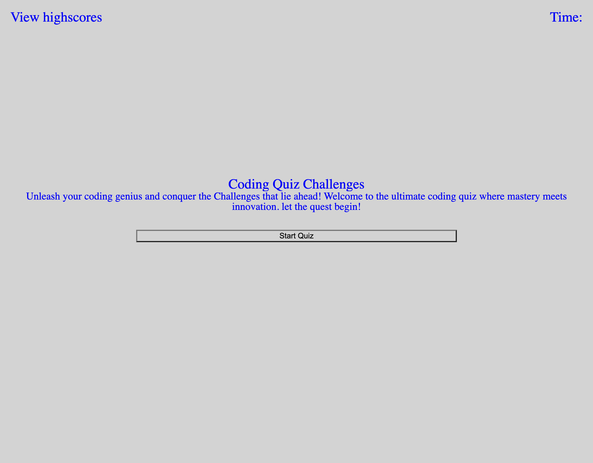

## Description
A timed coding quiz with multiple-choice questions.

## Installation 
N/A

## App link
https://tegaomare.github.io/Code_Quiz/
 
## Usage Instructions

AS A User you will take a timed quiz on JavaScript fundamentals, that stores high scores, so that you can gauge my progress compared to my peers

### Specifications
This app runs in the browser and  feature dynamically updated HTML and CSS powered by JavaScript. 

## Credits
https://github.com/croberts27/code-quiz-hw-4/blob/main/script.js

## License 
MIT license